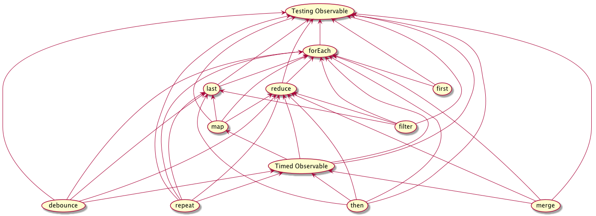

# Observable extensions tests

All extensions are tested with an [Observable] implentation based on [zen-observable].

[zen-observable] is not directly used in order to guarantee that no extension is using any of the [zen-observable] additional features which are not part of the [Observable] proposal.

Some tests depend on extensions, thus they are designed incrementally in order to avoid an issue hidden by cumulative bugs.
The following graph displays the precedence between test files and not between the extensions themselves:

> Arrows should be interpreted as "rely on an feature tested by".

[Observable]: https://github.com/tc39/proposal-observable
[zen-observable]: https://github.com/zenparsing/zen-observable
